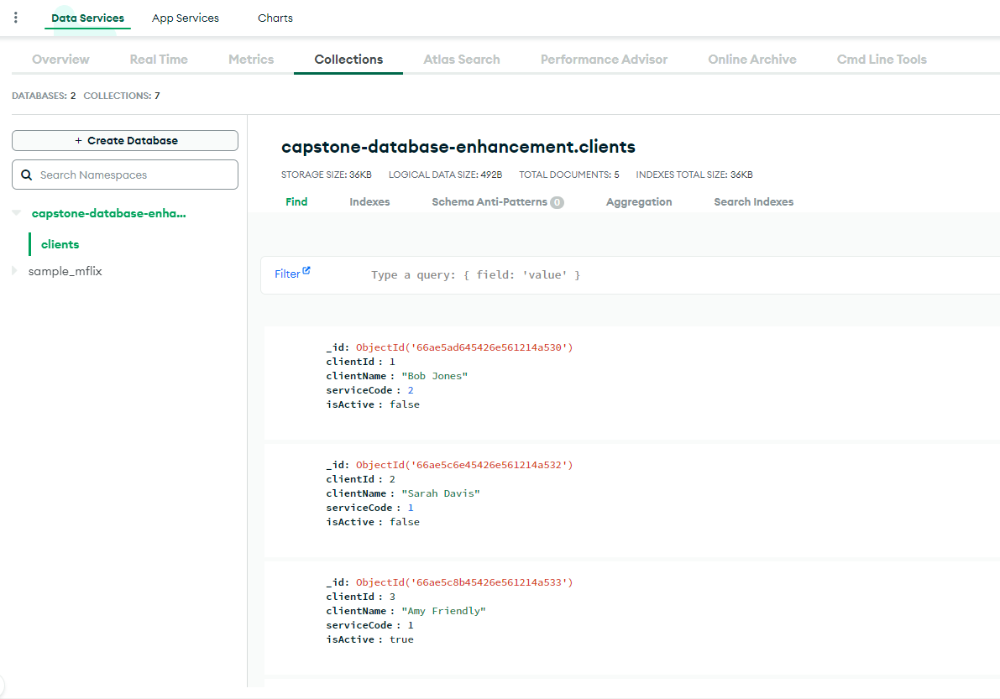

[Home](index.md)
# Enhancement Three: Databases

In the category of Databases, I have implemented a MongoDB cluster, database and collection to persistently store information on the clients. Originally, the client information was hardcoded in the source code – I have 
since moved and stored them as documents in the MongoDB collection I created.  I converted the Client class as a plain old Java object – or POJO – to interface with the Mongo collection. I was able to successfully connect 
to the database and provided an added layer of security using local environment variables as I’m pushing this to a GitHub environment, I do not want bad actors to be able to access the database and wreak havoc. 

## Enhancement Breakdown:

### Main():  

| Source      | Code                                                                                                                                |
| ----------  | ----------------------------------------------------------------------------------------------------------------------------------- |
| `Original`  | [Original Artifact](/software_engineering_and_design/Project2_C++_CS410.cpp){:target="_blank"}                                      |
| `Enhanced 1`| [Software Engineering and Design](/software_engineering_and_design/capstone/src/main/java/com/capstone/Main.java){:target="_blank"} |
| `Enhanced 2`| [Algorithms and Data Structures](/algorithms_and_data_structures/capstone/src/main/java/com/capstone/Main.java){:target="_blank"}   |
| `Enhanced 3`| [Databases](/databases/capstone/src/main/java/com/capstone/Main.java){:target="_blank"}                                             |

The main function has been trimmed down significantly since the initial enhancment. All of the methods that were used to manage client data has been moved into their own class file, leaving only a few methods in the Main class. I added calls to the DbConnect class to connect to the database after the user has been authenticated. The code has been adjusted to call methods from the new classes that were created. 

### Classes:  

| Class               | Code                                                                                                     |
| ------------------- | -------------------------------------------------------------------------------------------------------- |
| `Client()`          | [client-class](/databases/capstone/src/main/java/com/capstone/Client.java){:target="_blank"}             |
| `InputValidtors()`  | [input-valid](/databases/capstone/src/main/java/com/capstone/InputValidators.java){:target="_blank"}     |
| `DbConnection()`    | [db-connect](/databases/capstone/src/main/java/com/capstone/DbConnection.java){:target="_blank"}         |
| `ClientManager()`   | [client-manage](/databases/capstone/src/main/java/com/capstone/ClientManager.java){:target="_blank"}     |

#### Client():

The Client() class has been refactored as a POJO to stay consitent with OOP principles. Additionally a new field was added to the class constructor, isActive, which is a boolean value that's used to show whether the client is an active customer or not.

#### InputValidators():

No changes have been made to this class.

#### DbConnection():

The DbConnection() allows the Java program to connect to MongoDB. Additionally, code has been added to allow for MongoDB to be compatible with the Client POJO class. Lastly, additional connection methods were created to allow for calls to other databases or collections within the MongoDB cluster if needed. 

#### ClientManager():

The ClientManager() class was created to house all method pertaining to handling client data, these methods are:
- LoadClients()
- DisplayClients()
- CreateClient()
- ChangeClientChoice()
- ChangeActiveStatus()

The ChangeActiveStatus() method was created to handle "removing" clients. In the last enhancement, I mentioned I was having trouble determining how to handle deleting clients. I opted to go with an active status flag rather than straight up deleting users. Using this status, I added a request from the user to pass a filter value to the DisplayClients() method, and depending on the value the customer entered the method would print a list of either All Clients, All Active Clients, or All Inactive Clients. Were I to continue enhancing this program, I would eventually add a method to handle deleting clients. I could implement some automation where if a user was inactive for a set period of time, they would automatically be scrubbed from the system. This way, the system can retain data in the event a customer wanted to restore their account but remove customers who have been inactive long enough to clear out. 

The ClientManager() class retains the Map structure introduced in the previous enhancement however additional code was added to the methods to interact with the database. For instance, the LoadClients() function reads all the clients in MongoDB and then adds that data to a Map that interacts with all of the other methods. In the CreateClient(), ChangeClientChoice(), and ChangeActiveStatus() methods, the database and the map gets updated after a successful call to those methods have been made. 

## Database:

## Objectives Met:
Through these enhancements, I have met the following course objectives:

- Demonstrate an ability to use well-founded and innovative techniques, skills, and tools in computing practices for the purpose of implementing computer solutions that deliver value and accomplish industry-specific goals.
- Design and evaluate computing solutions that solve a given problem using algorithmic principles and computer science practices and standards appropriate to its solution while managing the trade-offs involved in design choices.   
- Develop a security mindset that anticipates adversarial exploits in software architecture and designs to expose potential vulnerabilities, mitigate design flaws, and ensure privacy and enhanced security of data and resources.

## Reflection and Challenges:
The biggest challenge was getting the database to connect properly and load client information into the Map I created. For a minute, the code kept returning null values for client names. It took me a minute to realize that I had named the BsonProperty something different than what I had defined in the MongoDB collection. Overall, I had a lot fun problem-solving through this activity and making good use of the MongoDB documention to troubleshoot. 

[Home](index.md)
